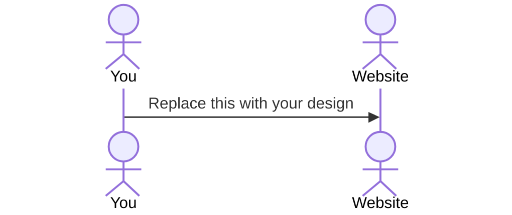

# Fantasy Helper!

[My Notes](notes.md)

> [!NOTE]
>  This is a template for your startup application. You must modify this `README.md` file for each phase of your development. You only need to fill in the section for each deliverable when that deliverable is submitted in Canvas. Without completing the section for a deliverable, the TA will not know what to look for when grading your submission. Feel free to add additional information to each deliverable description, but make sure you at least have the list of rubric items and a description of what you did for each item.

> [!NOTE]
>  If you are not familiar with Markdown then you should review the [documentation](https://docs.github.com/en/get-started/writing-on-github/getting-started-with-writing-and-formatting-on-github/basic-writing-and-formatting-syntax) before continuing.

## 🚀 Specification Deliverable

> [!NOTE]
>  Fill in this sections as the submission artifact for this deliverable. You can refer to this [example](https://github.com/webprogramming260/startup-example/blob/main/README.md) for inspiration.

For this deliverable I did the following. I checked the box `[x]` and added a description for things I completed.

- [x] Proper use of Markdown
- [x] A concise and compelling elevator pitch
- [x] Description of key features
- [x] Description of how you will use each technology
- [x] One or more rough sketches of your application. Images must be embedded in this file using Markdown image references.

## Elevator pitch:

Introducing Fantasy Football Helper, a sleek web app that takes your fantasy football game to the next level! Simply input your team roster, and our app displays key player details—names, positions, and projected fantasy points sourced from top platforms like ESPN, Sleeper, and Yahoo. Our main feature is an optimization tool that analyzes matchup projections to recommend your ideal starting lineup. Fantasy Football Helper empowers every team manager to make smarter, data-driven decisions in seconds. Elevate your fantasy game and dominate your league with Fantasy Football Helper!
### Design

Lorem ipsum dolor sit amet, consectetur adipiscing elit, sed do eiusmod tempor incididunt ut labore et dolore magna aliqua. Ut enim ad minim veniam, quis nostrud exercitation ullamco laboris nisi ut aliquip ex ea commodo consequat. Duis aute irure dolor in reprehenderit in voluptate velit esse cillum dolore eu fugiat nulla pariatur. Excepteur sint occaecat cupidatat non proident, sunt in culpa qui officia deserunt mollit anim id est laborum.

### Key features

* Secure login of team via HTTPS
* Display of roster
* Manipulation of roster slots
* View player
  * proj points
  * game time
  * opponent
  * health status
* *Optimization feature*
* Display of Optimized roster

### Technologies

I am going to use the required technologies in the following ways.

- **HTML** - Application of proper HTML use for the following pages: 1. Login 2. Page displaying the Fantasy team and optimization features
- **CSS** - My aesthetics of the roster display like player points, game time, opponent, and status will be through CSS. Smooth transitions and allignment is importanat for my Fantasy Helper.
- **React** - Display of roster slots, and manipulation of moving players in and out of starting lineups, shows optimization animation.
- **Service** - Handles tasks like logging users in securely and fetching data, such as player projections or team info, from your server to display on the site.
- **DB/Login** - torage system for keeping user info (like usernames and passwords) and app data (like player stats or saved lineups) safe and organized, so the site can retrieve or update it when needed.
- **WebSocket** - Pushes real-time updates, such as live player point changes during games, to your site without users refreshing the page.

## 🚀 AWS deliverable

For this deliverable I did the following. I checked the box `[x]` and added a description for things I completed.

- [x] **Server deployed and accessible with custom domain name** - [My server link](https://yourdomainnamehere.click).

## 🚀 HTML deliverable

For this deliverable I did the following. I checked the box `[x]` and added a description for things I completed.

- [x] **HTML pages** - I did not complete this part of the deliverable.
- [x] **Proper HTML element usage** - I did not complete this part of the deliverable.
- [x] **Links** - I did not complete this part of the deliverable.
- [x] **Text** - I did not complete this part of the deliverable.
- [x] **3rd party API placeholder** - I did not complete this part of the deliverable.
- [x] **Images** - I did not complete this part of the deliverable.
- [x] **Login placeholder** - I did not complete this part of the deliverable.
- [x] **DB data placeholder** - I did not complete this part of the deliverable.
- [x] **WebSocket placeholder** - I did not complete this part of the deliverable.

## 🚀 CSS deliverable

For this deliverable I did the following. I checked the box `[x]` and added a description for things I completed.

I linked all of my index.html, login.html, about.html pages to individual css files. Each css file has their own copied and pasted background, font, header, and nav styles. The biggest addition to my css deliverable is the integration of my login feature using bootstrap features. Other details I had to fix were some of the html tags like from a menu to ul tag. Each of the commits/push have a snentence desciribing what I had completed.

- [x] **Header, footer, and main content body** - I did not complete this part of the deliverable.
- [x] **Navigation elements** - I did not complete this part of the deliverable.
- [x] **Responsive to window resizing** - I did not complete this part of the deliverable.
- [x] **Application elements** - I did not complete this part of the deliverable.
- [x] **Application text content** - I did not complete this part of the deliverable.
- [x] **Application images** - I did not complete this part of the deliverable.

## 🚀 React part 1: Routing deliverable

For this deliverable I did the following. I checked the box `[x]` and added a description for things I completed.

I rearrages all my files so that Vite would accept the directory in the public and src folders. I added jsx files for each of my pages as well as an app.jsx and app.html for the routing and browser routes. At first it was kinda overwhelming, but once I did the Simon React with the video and finally moved onto my own startup it took me half the time because I understood alot more of what was going on. It was a fun activity, I wish I would've used more classes than basic html tags.

- [x] **Bundled using Vite** - I did not complete this part of the deliverable.
- [x] **Components** - I did not complete this part of the deliverable.
- [x] **Router** - I did not complete this part of the deliverable.

## 🚀 React part 2: Reactivity deliverable

For this deliverable I did the following. I updated my app.jsx and home.jsx files to add users. My app can now function using a login, logout featuyre that is attached to the local storage to remember users. I also made it so that the pages of my website are hidden till a user signs in with a username. 
I also added functionality for my home.jsx. The user has an attached file with player information that displayes their players points. It also has a live update section that uses setInterval to display updatyes after a certain duration of time. I hope I did everything required in this portion of the deliverable!

- [x] **All functionality implemented or mocked out** - I did not complete this part of the deliverable.
- [x] **Hooks** - I did not complete this part of the deliverable.

## 🚀 Service deliverable

For this deliverable I did the following. I checked the box `[x]` and added a description for things I completed. Man this was the hardest part of the deliverables so far but I have had so much fun learning about all this!

- [x] **Node.js/Express HTTP service** - I did not complete this part of the deliverable.
- [x] **Static middleware for frontend** - I did not complete this part of the deliverable.
- [x] **Calls to third party endpoints** - I did not complete this part of the deliverable.
- [x] **Backend service endpoints** - I did not complete this part of the deliverable.
- [x] **Frontend calls service endpoints** - I did not complete this part of the deliverable.
- [x] **Supports registration, login, logout, and restricted endpoint** - I did not complete this part of the deliverable.

## 🚀 DB deliverable

For this deliverable I did the following. I checked the box `[x]` and added a description for things I completed.

- [ ] **Stores data in MongoDB** - I did not complete this part of the deliverable.
- [ ] **Stores credentials in MongoDB** - I did not complete this part of the deliverable.

## 🚀 WebSocket deliverable

For this deliverable I did the following. I checked the box `[x]` and added a description for things I completed.

- [ ] **Backend listens for WebSocket connection** - I did not complete this part of the deliverable.
- [ ] **Frontend makes WebSocket connection** - I did not complete this part of the deliverable.
- [ ] **Data sent over WebSocket connection** - I did not complete this part of the deliverable.
- [ ] **WebSocket data displayed** - I did not complete this part of the deliverable.
- [ ] **Application is fully functional** - I did not complete this part of the deliverable.
